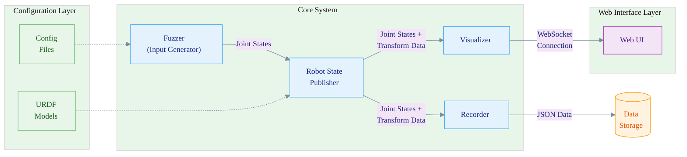
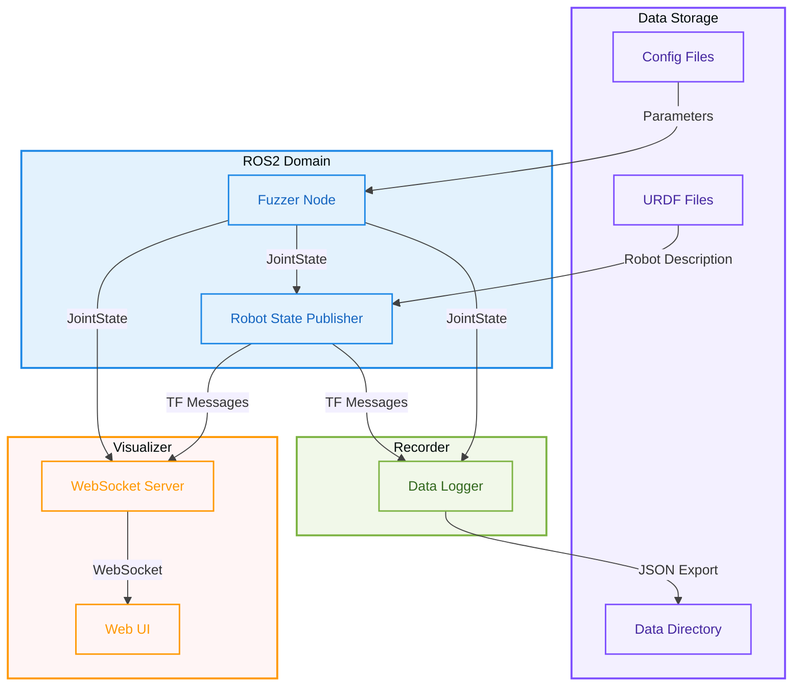
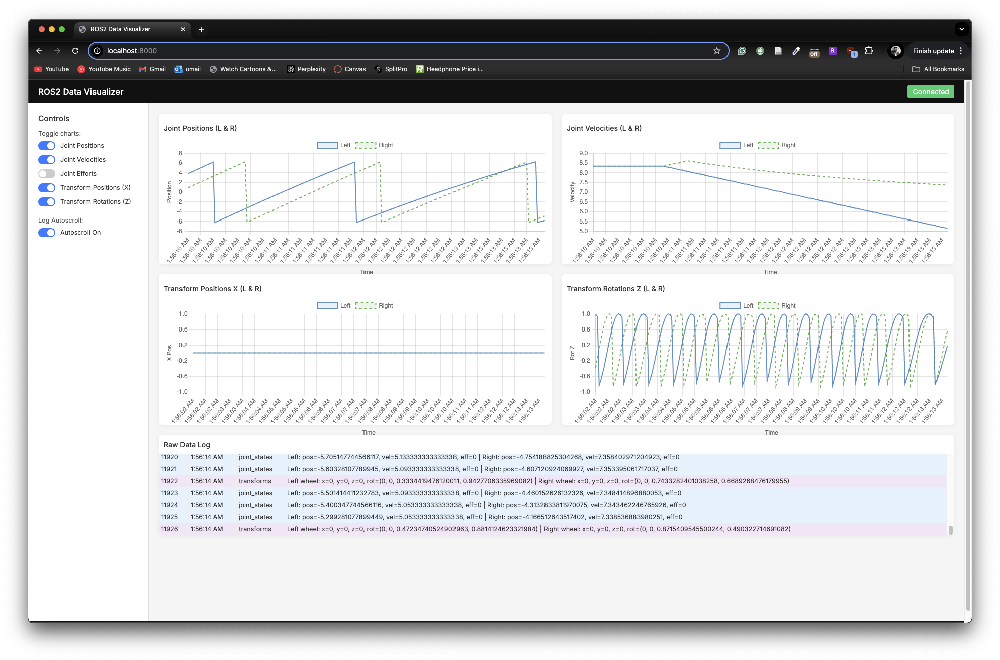

# ROS2 Robot Visualizer

A real-time visualization and data recording system for ROS2-based robots, specifically designed for the Turtlebot4 platform.

## Components

- **Robot State Publisher**: Publishes URDF-based robot state
- **Fuzzer**: Generates test motion patterns
- **Recorder**: Captures joint states and transform data
- **Visualizer**: Web-based real-time visualization dashboard

## Architecture





## Requirements

- Docker
- Docker Compose

## Quick Start

1. Clone the repository

2. Create a `data` directory for storing results:

    ```sh
    mkdir data
    ```

3. Start the system:

    ```sh
    docker-compose up
    ```

4. Open the visualizer in your browser:

    ```text
    http://localhost:8080
    ```

    The visualizer should display graphs containing the robot's joint states and transform data as follows:

    

5. Recorded data will be stored in the `data` directory. `data/results` directory will contain json files with the recorded data. File names starting with `joint_states` contain joint states data, and file names starting with `transforms` contain transform data. The files are suffixed with the timestamp when the recording started.
