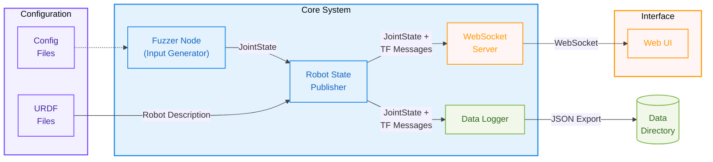
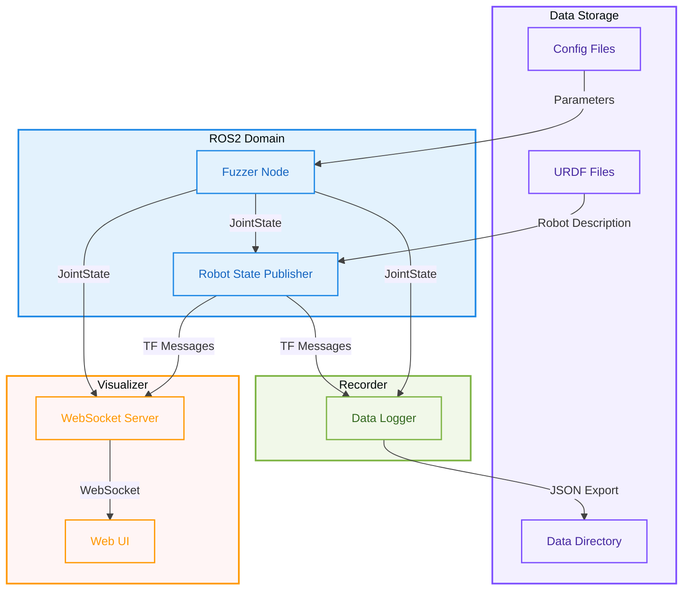

# RSP Fuzzer and Visualizer

A containerized system for testing and visualizing the behavior of the `robot_state_publisher` ROS package in isolation. This system generates test motion patterns to feed into the `robot_state_publisher` and visualizes the resulting joint states and transform data in real-time.

## Containers

- **Robot State Publisher**: [`robot_state_publisher`](https://wiki.ros.org/robot_state_publisher) uses the URDF specified by the parameter robot_description and the joint positions from the topic joint_states to calculate the forward kinematics of the robot and publish the results via [`tf`](https://wiki.ros.org/tf)
- **Fuzzer**: Generates test motion patterns to feed into the robot state publisher
- **Recorder**: Captures joint states and transform data from the `robot_state_publisher` and stores it in `JSON` format.
- **Visualizer**: Web-based real-time visualization dashboard

## Architecture

### High-Level Architecture

This architecture diagram shows the intended functionality of the system. Note that, the low level data flow between the components is abstracted in this diagram.



### Detailed Architecture

Even though the sysem is composed on four containers, the following diagram shows ther abstracted low level data flow between the components.



## Requirements

- Docker
- Docker Compose

## Quick Start

1. Clone the repository

2. Create a `data` directory for storing results:

    ```sh
    mkdir data
    ```

3. Start the system:

    ```sh
    docker-compose up
    ```

4. Open the visualizer in your browser:

    ```text
    http://localhost:8080
    ```

    The visualizer should display graphs containing the robot's joint states and transform data as follows:

    

5. Recorded data will be stored in the `data` directory. `data/results` directory will contain json files with the recorded data. File names starting with `joint_states` contain joint states data, and file names starting with `transforms` contain transform data. The files are suffixed with the timestamp when the recording started.
