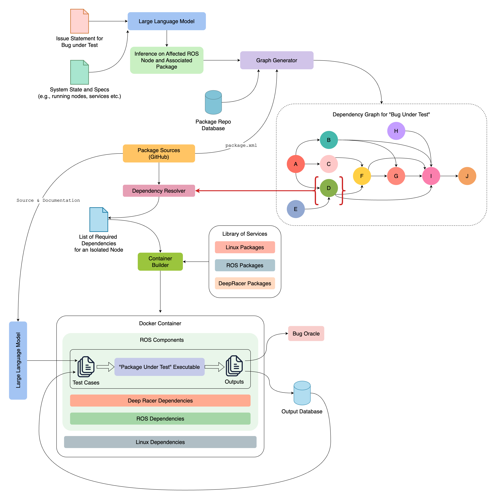
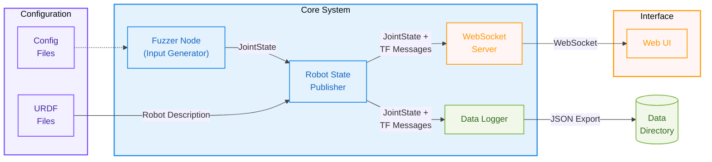
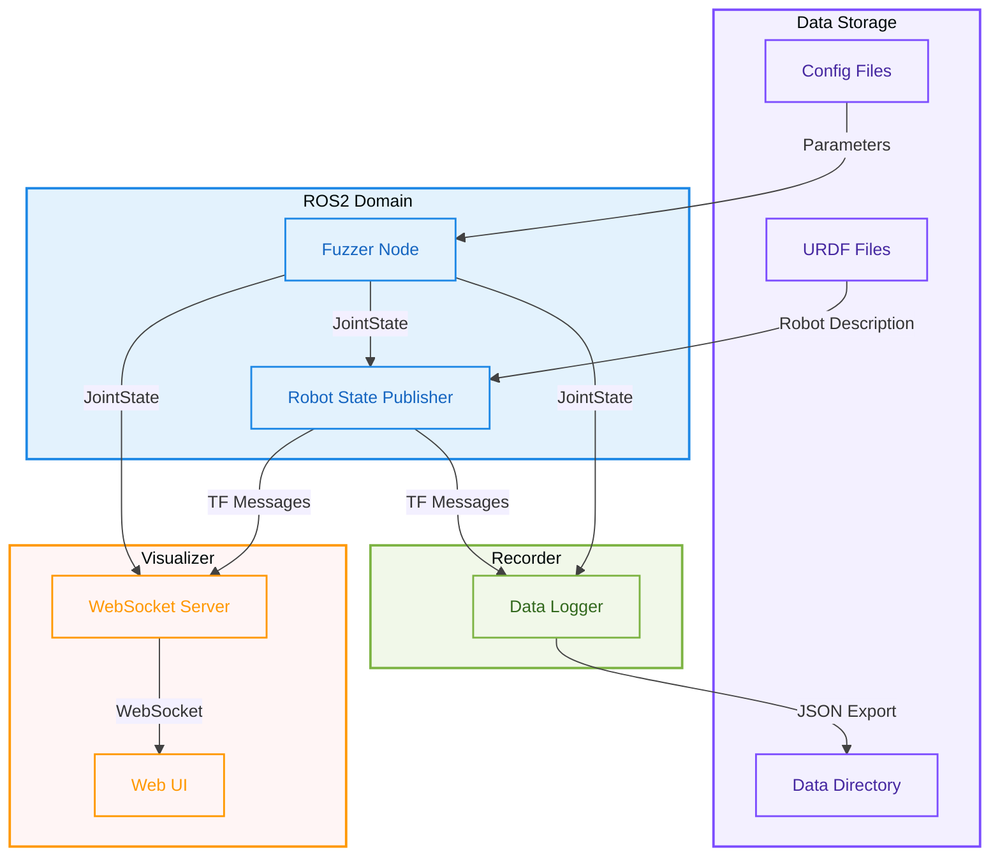

# Exploration of Container-Based ROS2 Fuzzing for Security Testing

### Abstract

Robotic systems built on ROS are increasingly deployed in safety-critical applications, making their security testing crucial. However, traditional testing approaches often require complex end-to-end simulation setups that are not only resource, time, and labor-intensive but also struggle to account for the interconnected nature of ROS nodes. This project is a component of a larger endeavour to develop a novel cyber-physical systems fuzzing framework that facilitates the isolated testing of individual ROS2 nodes or their combinations, which are part of a dependency tree originating from the most terminal node exhibiting symptoms of a specific issue. This project uses `robot_state_publisher` ROS2 node as a proof of concept to demonstrate the effectiveness of the proposed framework. This project uses docker containerization to host a ROS2 distribution and fuzz the `robot_state_publisher` node in isolation. The project includes a fuzzer component that generates test motion patterns, a recorder component that captures joint states and transform data, and a visualizer component that provides real-time monitoring of the system. The project demonstrates the effectiveness of the proposed framework by implementing a containerized virtual testbed with tools to generate input data, route it to proper ROS2 node, intercept and record the output data, and visualize it in real-time. This work also contributes to the broader field of cyber-physical security by providing a methodology for systematic, reproducible testing of ROS2 nodes in isolation, facilitating early detection of vulnerabilities without the complexity of full system simulation. The proposed approach can be extended to test other critical ROS2 components with automation interfaces for that can be used in the proposed framework, offering a practical solution for improving the security posture of robotic systems.

## Introduction

As cyber-physical systems (CPS) become integrated into critical aspects of society, from autonomous transportation to medical devices, their reliability and security are increasingly essential. Failures in these systems carry high stakes, as evidenced by incidents such as the Boeing 737 Max crashes[^1], where software malfunctions led to catastrophic failures, and Tesla's autonomous driving errors[^2][^3], which highlighted limitations in current autonomous technologies. Traditional software testing methods, however, are ill-suited for the complexities of CPS, where software, hardware, and real-world environments are tightly interwoven and interdependent.[^4]

Current CPS testing approaches, such as PGFUZZ[^5], have introduced fuzzing techniques to explore the input space more comprehensively, but these methods struggle with context: they rarely consider the interconnected nature of CPS components, which makes it difficult to reveal hidden faults that arise only in specific conditions or dependencies within the system. Without a deep understanding of these interactions, CPS tests often miss bugs that could manifest in unpredictable or dangerous ways in real-world applications. Furthermore, testing these systems often requires complex end-to-end simulation setups, as demonstrated in ROCAS [^6],that are resource-intensive and time-consuming, making it challenging to isolate and identify the root causes of issues.

This research presents an initial step toward addressing these challenges by developing a containerized testing framework for ROS2 nodes, demonstrated through the isolated testing of the `robot_state_publisher` node. This proof-of-concept implementation serves as a foundation for our broader vision: Deep-Fuzz, a context-aware fuzzing framework tailored for the Robot Operating System (ROS). Our current approach demonstrates the feasibility of isolated node testing within a containerized environment, while the complete framework will use Large Language Models (LLMs) to infer complex dependencies among ROS nodes and their safety properties, generating test cases that reflect real-world operating conditions with greater accuracy.


<!-- Center and italic caption for image with HTML -->
<p style="text-align: center; font-style: italic;">Figure 1: Preliminarily Conceptualized Architecture of Deep-Fuzz</p>

The containerized virtual testbed developed in this project includes components for fuzzing input generation, data recording, and real-time visualization, establishing a methodology for systematic, reproducible testing of ROS2 nodes in isolation. This framework aims to uncover subtle vulnerabilities and system weaknesses that traditional end-to-end fuzzing would likely overlook, enhancing the safety and robustness of CPS applications and helping to mitigate the potentially severe consequences of undetected software flaws in safety-critical systems.

## Background and Related Work

Cyber-physical systems (CPS) pose unique challenges for testing due to their reliance on complex interactions between software, hardware, and real-world conditions. Unlike traditional software, CPS vulnerabilities often emerge from the intricate dependencies among components, which standard testing methods struggle to capture. This complexity is particularly evident in ROS-based systems, where faults commonly arise from interactions between interconnected nodes rather than isolated issues.

Recent work in CPS testing has introduced techniques to explore the input space more dynamically. Policy-Guided Fuzzing (PGFUZZ), for example, was developed to expose policy violations in robotic vehicles by pushing the system into unusual states. While effective at identifying high-level policy breaches, PGFUZZ does not account for the nuanced dependencies between components that often give rise to more subtle, context-specific faults—especially in complex architectures like the Robot Operating System (ROS). Similarly, tools like FuzzSim[^7] and RoboFuzz[^8] have attempted to adapt fuzzing for CPS but do not adequately capture dynamic dependencies among components.

A complementary approach, PatchVerif[^9], takes a focused look at software updates, aiming to identify faults introduced by patches in robotic control software. While effective at catching post-update bugs with physical implications, PatchVerif's scope is limited to analyzing specific patches, rather than proactively examining how pre-existing interactions in CPS might give rise to faults during routine operations.

These approaches, while useful, illustrate a gap in CPS testing methodologies. Both focus on isolated aspects—policy adherence in PGFUZZ and patch-induced faults in PatchVerif—without addressing the broader dependencies inherent to CPS. This gap is especially problematic for systems built on ROS, where faults often result from interactions across interconnected nodes and packages, not just from isolated input scenarios or recent updates. For instance, a fault might only occur when sensor data from one node triggers an unexpected response in an actuator node, a scenario that tools lacking dependency awareness might miss [^10].

Our current project addresses this critical gap in these approaches by demonstrating the feasibility of isolated node testing within a containerized environment. By focusing on the `robot_state_publisher` node as a proof of concept, we establish a methodology for testing individual ROS2 components without the overhead of full system simulation. This approach allows for more precise fault detection and validation, serving as a stepping stone toward our broader goal of developing Deep-Fuzz.

## Methodology

The methodology of this project involves designing and implementing a containerized virtual testbed for fuzzing the `robot_state_publisher` ROS2 node. The testbed consists of four primary components: docker-hosted ROS2 distribution with the `robot_state_publisher` node, a Fuzzer component for generating test motion patterns, a Recorder component for capturing joint states and transform data, and a Visualizer component for real-time monitoring of the system’s behavior.

### System Design

From a high-level perspective, the system can be visualized as follows:


<!-- Center and italic caption of the figure in HTML -->
<p style="text-align: center; font-style: italic;">Figure 2: High Level System Diagram </p>

The `robot_state_publisher` node takes `robot_description` as a parameter to start and subscribes to `joint_states` messages. These messages, typically published by the robot’s hardware interface or `joint_state_controller` node, are instead generated in this project by the Fuzzer component. This component publishes synthetic `joint_states` messages to simulate the robot’s motion. The `robot_state_publisher` node calculates the forward kinematics of the robot using this input and publishes the corresponding transform data to the `tf` topic. The Recorder component captures both `joint_states` and `tf` data from their respective topics and stores them as `JSON` files on a Docker volume. Meanwhile, the Visualizer component provides a web-based real-time dashboard, enabling monitoring of the system’s behavior throughout the process.

### Implementation Details


<!-- Center and italic caption of the figure in HTML -->
<p style="text-align: center; font-style: italic;">Figure 3: Low-level Data Flow Diagram </p>

This project is a composition of four docker containers, each hosting a specific component:

1. **Robot State Publisher**: This container hosts the ROS2 distribution with the `robot_state_publisher` node. We used [TurtleBot4](https://clearpathrobotics.com/turtlebot-4/) as the robot model for this project. The URDF, sourced from the [`turtlebot4` repository ](https://github.com/turtlebot/turtlebot4), provides a description of the robot’s structure and kinematics, which is passed to the node through the robot_description parameter to enable its initialization:

    ```bash
    ros2 run robot_state_publisher robot_state_publisher --ros-args -p robot_description:=/path/to/urdf 
    ```

    This node subscribes to the `joint_states` topic to receive the robot’s joint positions, which are used to calculate the forward kinematics and publish the results via the `tf` topic.

2. **Fuzzer**: The Fuzzer component generates test motion patterns to feed into the `robot_state_publisher` node. These patterns simulate the robot’s motion and are published to the `joint_states` topic. The Fuzzer component is responsible for generating a variety of test cases to explore the input space and trigger different behaviors in the `robot_state_publisher` node. At this stage, the project uses simple sinusoidal patterns to demonstrate the system’s functionality. However, the Fuzzer component can be extended to generate more complex and diverse test cases in future iterations.

3. **Recorder**: The Recorder component captures joint states and transform data from the `robot_state_publisher` node and stores it in `JSON` format. This data is essential for analyzing the system’s behavior and identifying potential vulnerabilities or faults. The Recorder component records the system’s output throughout the testing process, enabling detailed post-analysis of the system’s behavior. This component is designed to be lightweight and efficient, ensuring minimal impact on system performance during testing, while its isolated nature enables precise data capture without interference from other components.

4. **Visualizer**: The Visualizer component provides a web-based real-time visualization dashboard for monitoring the system’s behavior. This component displays the robot’s motion, joint states, and transform data in real-time, enabling users to observe the system’s behavior throughout the testing process. The Visualizer component has a websocket server that receives `joint_states` and `tf` messages from respective topics and passes them as JSON objects to the web UI for visualization. The web UI is a simple dashboard that displays the robot’s motion and kinematics, providing users with a clear and intuitive interface for monitoring the system’s behavior.

    

    <!-- Center and italic caption of the figure in HTML -->
    <p style="text-align: center; font-style: italic;">Figure 4: Web UI for Real-time Monitoring</p>

### Artifacts

This report is accompanied by a [GitHub repository](https://github.com/iotrustlab/ros2-rsp-docker/tree/main) containing the source code and configuration files for the project. The repository includes detailed instructions for setting up and running the system, as well as [documentation](https://github.com/iotrustlab/ros2-rsp-docker/blob/main/README.md) on the project’s architecture and components.

#### Quick Start

With `docker` and `docker-compose` installed, the system can be set up and run with the following steps:

1. Clone the repository:

    ```bash
    git clone https://github.com/iotrustlab/ros2-rsp-docker.git
    ```

2. Create a `data` directory for storing results:

    ```bash
    mkdir data
    ```

3. Start the system:

    ```bash
    docker-compose up
    ```

4. [Open](http://localhost:8000) the visualizer web console in browser:

    ```text
    http://localhost:8000
    ```

## Result and Discussion

This project demonstrates that containerization can be used tp effectively isolate and fuzz individual ROS2 nodes—in this case, the `robot_state_publisher` node—without the complexity of end-to-end simulation. By generating synthetic joint state inputs, capturing the resulting transforms, and visualizing the data in real-time, the system provides a more targeted environment for exploring potential vulnerabilities. This approach streamlines the testing process, allowing researchers and developers to focus on specific ROS2 components and their dependencies rather than dealing with the overhead of an entire robotic software stack.

Primary limitation of the current implementation is the lack of automated extension to other ROS2 nodes. The system is designed to host the `robot_state_publisher` node specifically manually configuring it for only this node. Future work will focus on creating a more generalized interface that can be easily extended to other ROS2 nodes, enabling broader testing capabilities within the proposed framework.

Other limitations include the simplicity of the test motion patterns generated by the Fuzzer component and its lack of extensibility for more complex scenarios. Future iterations will enhance the Fuzzer component to analyze the source code of the ROS2 node under test and generate more diverse and sophisticated test cases to explore the input space more comprehensively.

Also, to achieve the greater vision of Deep-Fuzz, the system will require the integration to other components like Bug Oracles, Dependency Graph Generators and Large Language Models to extract safety properties from the codebase and its documentation. This will enable the system to generate test cases that reflect real-world operating conditions with greater accuracy and uncover subtle vulnerabilities that traditional testing methods would likely overlook.

## Conclusion

This project presents a containerized virtual testbed for fuzzing ROS2 nodes, demonstrated through the isolated testing of the `robot_state_publisher` node. The system generates motion patterns, feed them to the node, intercepts the output data, and creates real-time visualization. The project establishes a methodology for systematic, reproducible testing of ROS2 nodes in isolation, enabling more focused fault detection and validation without the complexity of full system simulation.

By establishing a containerized testing environment specifically for the `robot_state_publisher` node, this project provides a proof-of-concept for a more granular, reproducible approach to fuzzing ROS2 components. Although still preliminary and limited in scope, the work lays a foundation for a broader, more sophisticated methodology. Extending the framework to other nodes, enhancing input generation techniques and formulating the bug oracles will bring us closer to a full-fledged, context-aware fuzzing framework. Such advancements hold promise for earlier and proactive vulnerability detection and overall improvements in the safety and reliability of cyber-physical robotic systems.

## References

[^1]: P. Johnston and R. Harris, “The boeing 737 max saga: lessons for software organizations,” Software Quality Professional, vol. 21, no. 3, pp. 4–12, 2019.
[^2]: B. Fung, “The technology behind the Tesla crash, explained,” Washington Post, Jul. 2016. [Online]. Available: [washingtonpost.com](https://www.washingtonpost.com/news/the-switch/wp/2016/07/01/the-technology-behind-the-tesla-crash-explained/)
[^3]: K. Lyons, “Two people killed in fiery Tesla crash with no one driving,” Apr. 2021. [Online]. Available: [theverge.com](https://www.theverge.com/2021/4/18/22390612/two-people-killed-fiery-tesla-crash-no-driver)
[^4]: X. Zhou, X. Gou, T. Huang, and S. Yang, “Review on testing of cyber physical systems: Methods and testbeds,” IEEE Access, vol. 6, pp. 52 179–52 194, 2018.
[^5]: H. Kim, M. O. Ozmen, A. Bianchi, Z. B. Celik, and D. Xu, “Pgfuzz: Policy-guided fuzzing for robotic vehicles,” in Proceedings of the Network and Distributed System Security Symposium (NDSS), 2021.
[^6]: S. Feng et al., ‘ROCAS: Root Cause Analysis of Autonomous Driving Accidents via Cyber-Physical Co-mutation’, arXiv [cs.SE](https://arxiv.org/abs/2409.07774). 2024.
[^7]: M. Woo, S. K. Cha, S. Gottlieb, and D. Brumley, “Scheduling black- box mutational fuzzing,” in Proceedings of the 2013 ACM SIGSAC Conference on Computer & Communications Security, ser. CCS ’13. New York, NY, USA: Association for Computing Machinery, 2013, p. 511–522. [Online]. Available: https://doi.org/10.1145/2508859.2516736 
[^8]: S. Kim and T. Kim, “Robofuzz: fuzzing robotic systems over robot operating system (ros) for finding correctness bugs,” in Proceedings of the 30th ACM Joint European Software Engineering Conference and Symposium on the Foundations of Software Engineering, ser. ESEC/FSE 2022. New York, NY, USA: Association for Computing Machinery, 2022, p. 447–458. [Online]. Available: https://doi.org/10.1145/3540250.3549164
[^9]: H. Kim, M. O. Ozmen, Z. B. Celik, A. Bianchi, and D. Xu, “PatchVerif: discovering faulty patches in robotic vehicles,” in Proceedings of the 32nd USENIX Conference on Security Symposium, ser. SEC ’23. USA: USENIX Association, Aug. 2023, pp. 3011–3028. 
[^10]: S. Kim, Y. Eun, and K.-J. Park, “Stealthy sensor attack detection and real-time performance recovery for resilient cps,” IEEE Transactions on Industrial Informatics, vol. 17, pp. 7412–7422, 2021.
